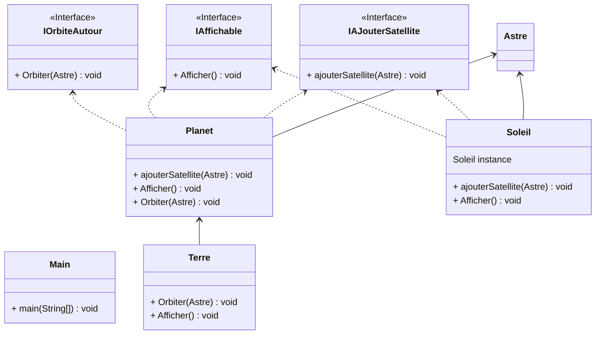

```mermaid
classDiagram
direction BT
class Astre
class IAJouterSatellite {
<<Interface>>
  + ajouterSatellite(Astre) void
}
class IAffichable {
<<Interface>>
  + Afficher() void
}
class IOrbiteAutour {
<<Interface>>
  + Orbiter(Astre) void
}
class Main {
  + main(String[]) void
}
class Planet {
  + ajouterSatellite(Astre) void
  + Afficher() void
  + Orbiter(Astre) void
}
class Soleil {
  + ajouterSatellite(Astre) void
  + Afficher() void
   Soleil instance
}
class Terre {
  + Orbiter(Astre) void
  + Afficher() void
}

Planet  -->  Astre 
Planet  ..>  IAJouterSatellite 
Planet  ..>  IAffichable 
Planet  ..>  IOrbiteAutour 
Soleil  -->  Astre 
Soleil  ..>  IAJouterSatellite 
Soleil  ..>  IAffichable 
Terre  -->  Planet
```
